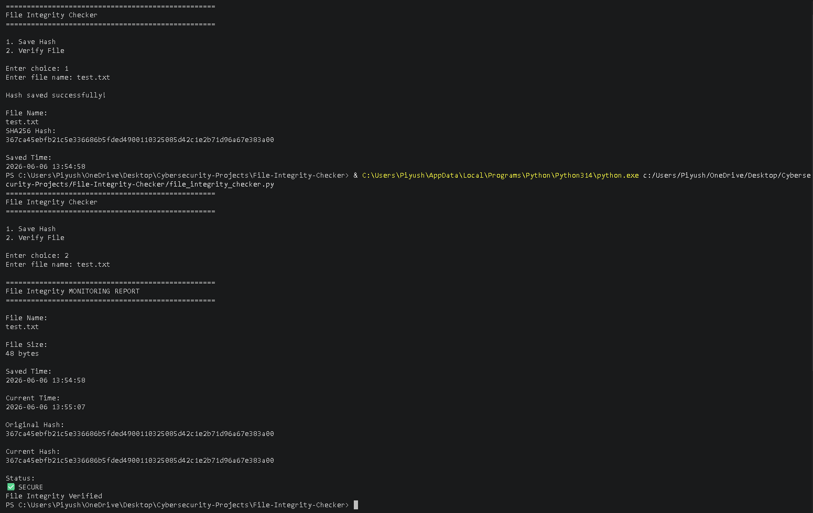
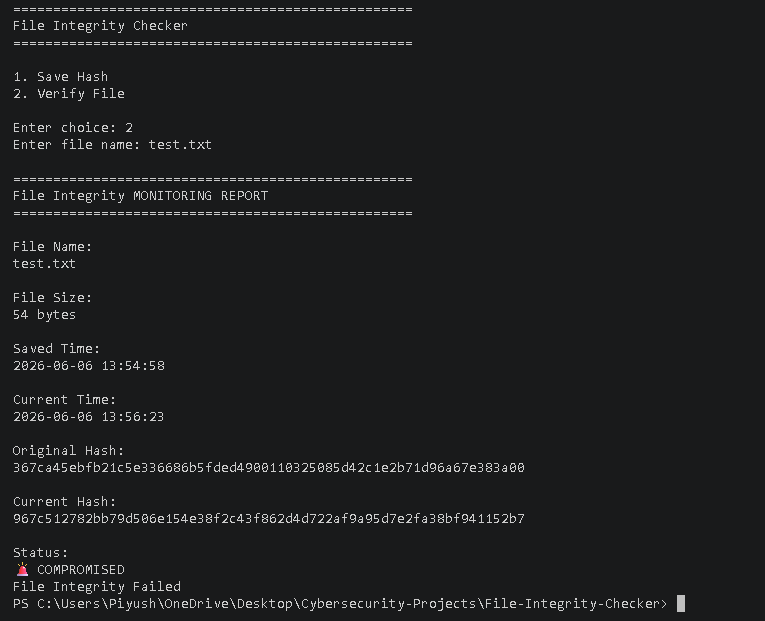

# 🔐 File Integrity Checker

A simple cybersecurity project built with Python to monitor file integrity using SHA256 hashing.

The idea behind this project is straightforward: if a file is modified, even by a single character, its hash value changes completely. By comparing the current hash with a previously saved hash, the tool can detect unauthorized or unexpected modifications.

This project helped me understand concepts used in File Integrity Monitoring (FIM), Digital Forensics, and Security Monitoring.

---

## 🚀 Features

✔ Generate SHA256 hashes for files

✔ Save file hashes with timestamps

✔ Verify file integrity

✔ Detect file modifications

✔ Display file size information

✔ Generate a detailed integrity report

✔ Prevent duplicate hash records

---

## 📸 Example Reports

### Secure File

```text
Status:
✅ SECURE
File Integrity Verified
```

### Modified File

```text
Status:
🚨 COMPROMISED
File Integrity Failed
```
## Project Overview


## Integrity Verified



## Integrity Failed


---

## 🛠 Technologies Used

* Python
* hashlib
* datetime

---

## 📚 What I Learned

While building this project, I learned:

* How cryptographic hash functions work
* Difference between MD5 and SHA256
* File Integrity Monitoring (FIM)
* Basic Digital Forensics concepts
* Reading and writing files in Python
* Creating simple security monitoring tools

---

## 🎯 Future Improvements

* Monitor multiple files automatically
* Export reports to a log file
* Add folder monitoring
* Create a graphical user interface (GUI)
* Send alerts when a file is modified

---

## 👨‍💻 Author

**Piyush Vishwakarma**

Aspiring Cybersecurity Professional | MCA Cybersecurity Student

GitHub: https://github.com/ItsPiyushVishwakarma